<p align="center">
  
</p>

<h1 align="center">BeFake</h1>
<h3 align="center"><em>Sahte Ol. Gerçek Yaşa.</em></h3>
<p align="center">Sosyal Simülasyon & Oyunlaştırılmış Zaman Döngülü Sosyal Medya Platformu</p>

<p align="center">
  <strong>🌐 Canlı Demo:</strong> <a href="https://0gunes.github.io/befake-frontend/">https://0gunes.github.io/befake-frontend/</a>
</p>

---

## 📋 İÇİNDEKİLER

1. [Problem & Fırsat](#-problem--fırsat)
2. [Çözümümüz: BeFake](#-çözümümüz-befake)
3. [Ürün Demo & Ekran Görüntüleri](#-ürün-demo--ekran-görüntüleri)
4. [Core Loop — Nasıl Çalışır?](#-core-loop--nasıl-çalışır)
5. [Karakter Sistemi](#-karakter-sistemi)
6. [Sosyal Akış & İsyan Mekanizması](#-sosyal-akış--isyan-mekanizması)
7. [Monetizasyon Modeli](#-monetizasyon-modeli)
8. [Pazar Analizi & Büyüme Stratejisi](#-pazar-analizi--büyüme-stratejisi)
9. [Teknik Mimari](#-teknik-mimari)
10. [Keşfet Algoritması](#-keşfet-algoritması)
11. [Yol Haritası](#-yol-haritası)
12. [Ekip & İletişim](#-ekip--iletişim)

---

## 🔥 PROBLEM & FIRSAT

### Sosyal Medyanın Kırılma Noktası

Günümüz sosyal medyası kullanıcıları **iki baskı** arasına sıkıştırdı:

| Baskı | Platform | Sonuç |
|---|---|---|
| **"Mükemmel Ol"** | Instagram, TikTok | Kusursuz görünme kaygısı, mental sağlık sorunları |
| **"Kendin Ol"** | BeReal, Locket | Samimiyetin zorla dayatılması, "authenticity fatigue" |

> **Her iki yaklaşım da aynı soruna çarpıyor:** Kullanıcılar kendi kimliklerine zincirlenmiş. Gerçek adları, yüzleri ve sosyal çevreleri her paylaşımı bir performansa dönüştürüyor.

### Kaçırılan Fırsat

- 🎮 **Gaming dünyası** bunu çözmüştü: MMO'lar, roleplay sunucuları, karakter oluşturma — milyonlarca insan *başka biri olarak* sosyalleşiyor.
- 📱 **Ama sosyal medya** bu deneyimi hiç sunmadı.

**BeFake bu boşluğu dolduruyor.**

---

## 💡 ÇÖZÜMÜMÜZ: BeFake

> *"Ya sosyal medyada kendin olmak zorunda olmasaydın?"*

BeFake, kullanıcılara **dönemsel kurgusal dünyalarda anonim roller** vererek tamamen yeni bir sosyal deneyim sunuyor:

- 🎭 **Anonim Roleplay** — Gerçek kimliğin gizli, karakter kimliğin ön planda
- 🌍 **Dönemsel Sezonlar** — Her 1-2 ayda yeni bir dünya (Orta Çağ → Siberpunk → Antik Mısır...)
- 🌳 **Soy Ağacı** — Devasa bir graf yapısında aile üyesi olarak doğ
- ⚔️ **Drama & İsyan** — Topluluk odaklı hikaye dallanması, taht devrimleri
- 🔄 **Sıfırdan Başla** — Sezon bitince herkes eşit, yeni dünya, yeni hikaye

<p align="center">
  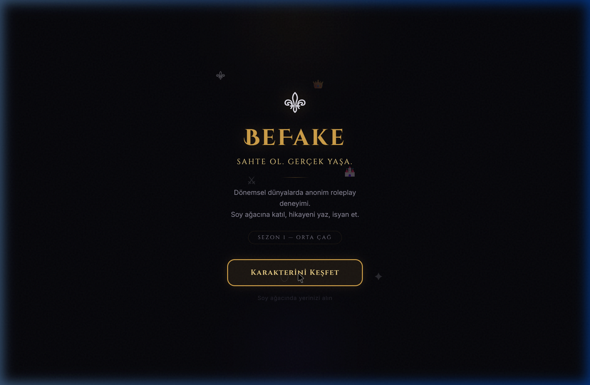
  <br/>
  <em>BeFake Giriş Ekranı — Sezon 1: Orta Çağ</em>
</p>

---

## 🖥️ ÜRÜN DEMO & EKRAN GÖRÜNTÜLERİ

### Canlı Demo

> **🌐 [https://0gunes.github.io/befake-frontend/](https://0gunes.github.io/befake-frontend/)**
>
> Tam interaktif demo: Karakter seçimi → Sosyal akış → İsyan mekanizması

### Interaktif Akış Kaydı

<p align="center">
  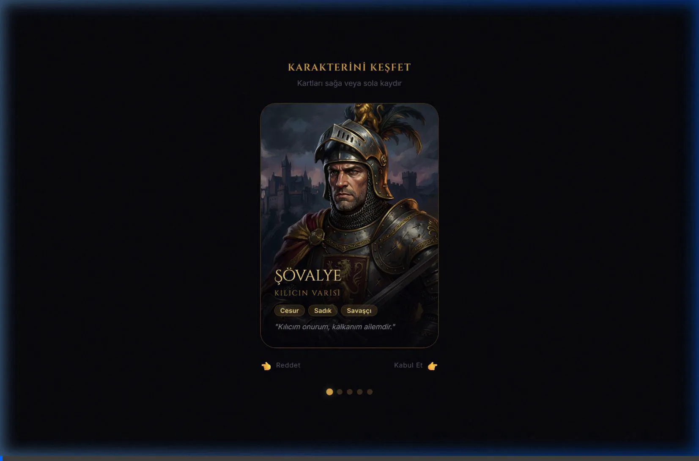
  <br/>
  <em>Landing → Karakter Testi → Sonuç Ekranı → Timeline → İsyan Modu</em>
</p>

### Ekran Görüntüleri

<table>
  <tr>
    <td align="center" width="33%">
      <br/>
      <strong>1. Giriş Ekranı</strong><br/>
      <em>Sinematik karşılama</em>
    </td>
    <td align="center" width="33%">
      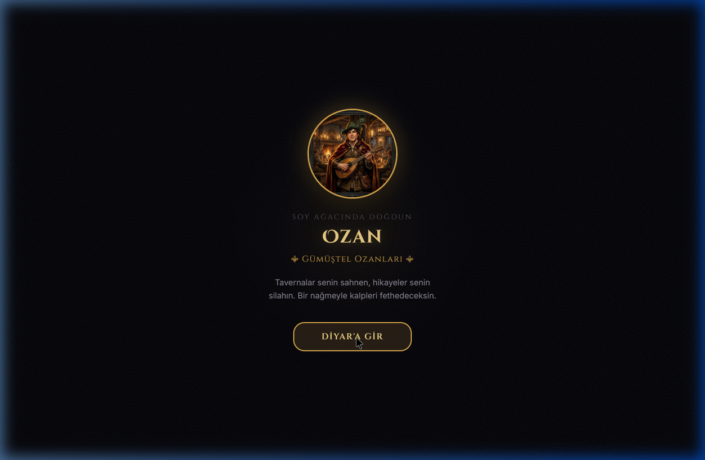<br/>
      <strong>2. Karakter Atama</strong><br/>
      <em>Soy ağacında doğuş</em>
    </td>
    <td align="center" width="33%">
      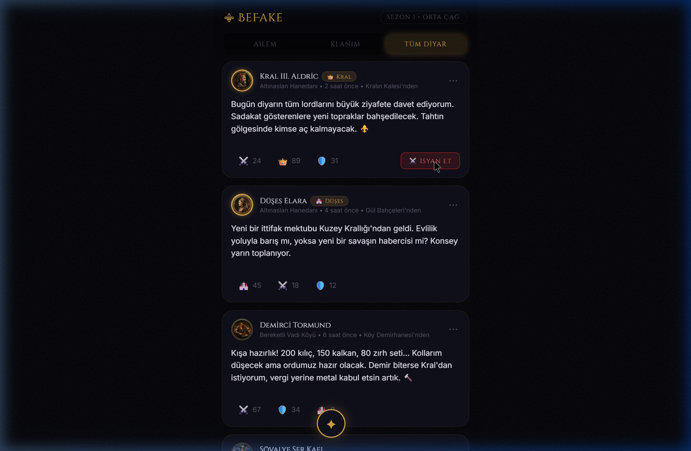<br/>
      <strong>3. Sosyal Akış</strong><br/>
      <em>Döneme uygun feed</em>
    </td>
  </tr>
</table>

---

## 🔄 CORE LOOP — NASIL ÇALIŞIR?

```
┌──────────────────────────────────────────────────────────┐
│                    SEZON BAŞLANGICI                       │
│              (Ör: Sezon 1 — Orta Çağ)                    │
└──────────────────┬───────────────────────────────────────┘
                   ▼
         ┌─────────────────┐
         │  KARAKTER TESTİ │  ◄── Sağa/Sola Swipe
         │  (Onboarding)   │      5 kart, kişilik eğilimi
         └────────┬────────┘
                  ▼
         ┌─────────────────┐
         │  SOY AĞACI      │  ◄── Graf tabanlı (Neo4j)
         │  ATAMASI        │      Rastgele aile ferdi
         └────────┬────────┘
                  ▼
    ┌─────────────────────────────┐
    │      AKTİF SEZON DÖNGÜSÜ   │
    │  ┌───────┐  ┌───────────┐  │
    │  │ Post  │  │ Chat &    │  │
    │  │ Paylaş│  │ Aile      │  │
    │  │       │  │ Sohbeti   │  │
    │  └───┬───┘  └─────┬─────┘  │
    │      │            │        │
    │      ▼            ▼        │
    │  ┌───────────────────┐     │
    │  │  Etkileşim &      │     │
    │  │  Drama Olayları   │     │  ◄── İsyan, İttifak,
    │  │  (AI Destekli)    │     │      Görev Atamaları
    │  └───────────────────┘     │
    └─────────────┬───────────────┘
                  ▼
         ┌─────────────────┐
         │  SEZON SONU     │  ◄── Arşive kalkar
         │  Herkes sıfırdan│      (Read-Only müze)
         └─────────────────┘
```

---

## 🎭 KARAKTER SİSTEMİ

Kullanıcılar ilk girişte **Tinder tarzı bir kişilik testi** çözer. Kartları sağa (kabul) veya sola (red) kaydırarak kendi karakter eğilimlerini belirler.

### Sezon 1: Orta Çağ Karakterleri

<table>
  <tr>
    <td align="center" width="20%">
      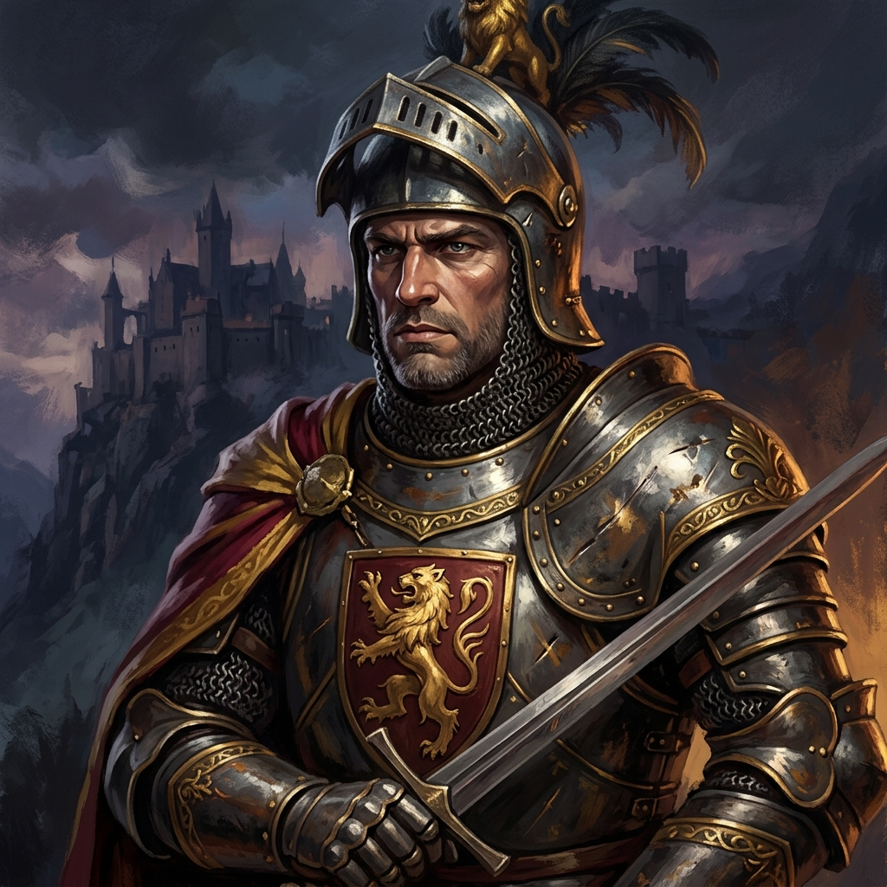<br/>
      <strong>⚔️ Şövalye</strong><br/>
      <em>Cesur • Sadık • Savaşçı</em>
    </td>
    <td align="center" width="20%">
      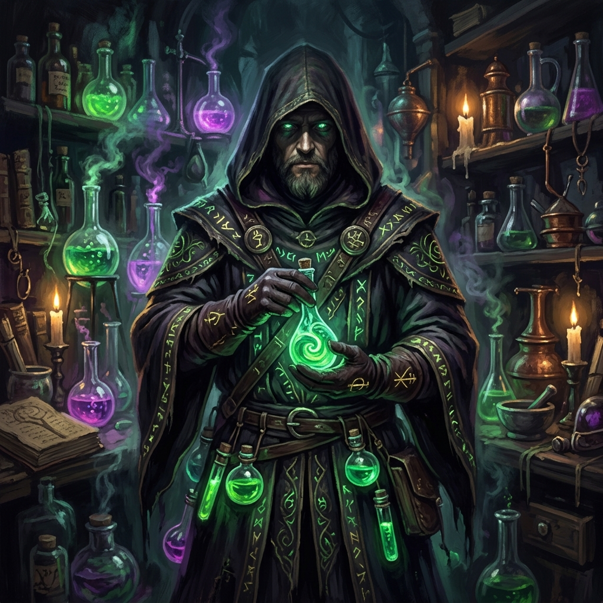<br/>
      <strong>🧪 Simyacı</strong><br/>
      <em>Gizemli • Zeki • Meraklı</em>
    </td>
    <td align="center" width="20%">
      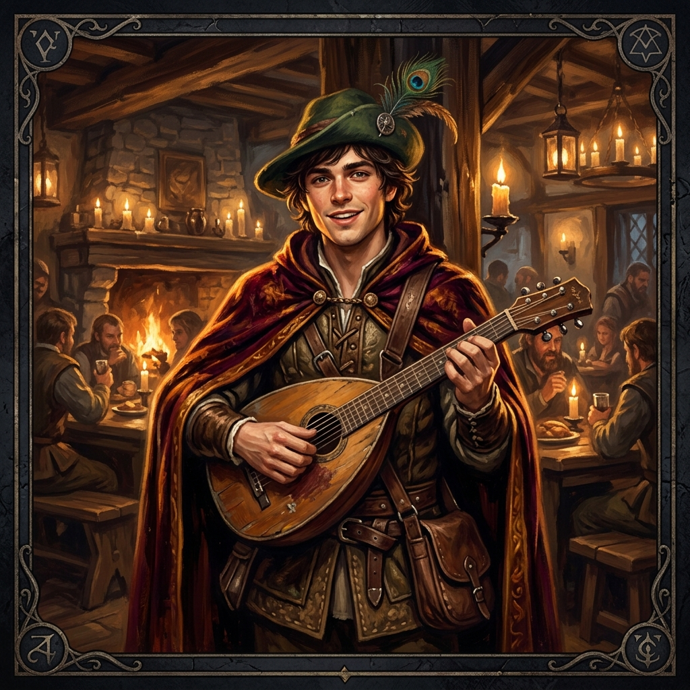<br/>
      <strong>🎵 Ozan</strong><br/>
      <em>Karizmatik • Kurnaz • Eğlenceli</em>
    </td>
    <td align="center" width="20%">
      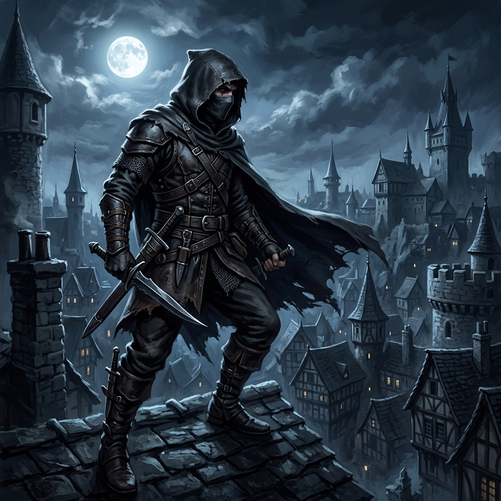<br/>
      <strong>🗡️ Casus</strong><br/>
      <em>Sinsi • Çevik • Tehlikeli</em>
    </td>
    <td align="center" width="20%">
      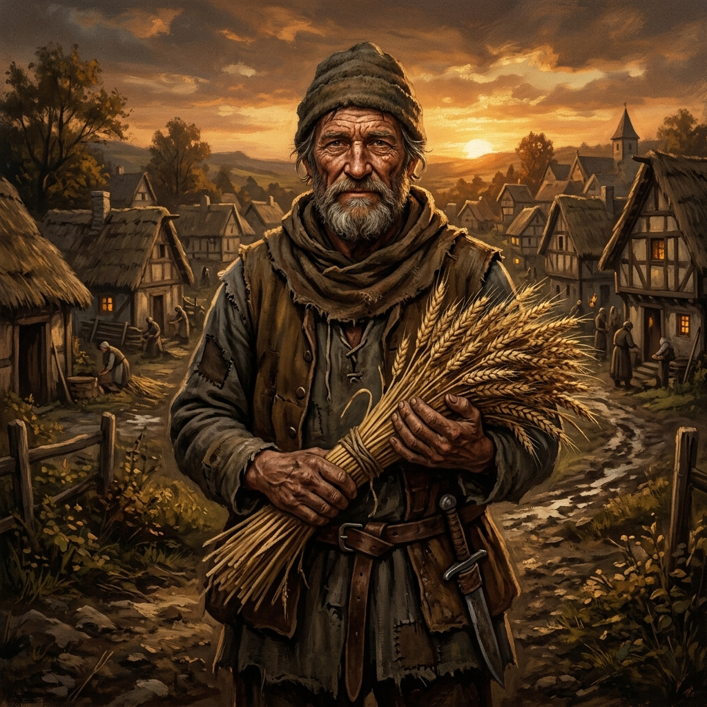<br/>
      <strong>🌾 Köylü</strong><br/>
      <em>Dayanıklı • Kanaatkar • Sezgisel</em>
    </td>
  </tr>
</table>

### Swipe Mekanizması

- **Sağa Kaydır (Kabul)** → Yeşil "KABUL ✓" overlay, kart sağa uçar
- **Sola Kaydır (Red)** → Kırmızı "RED ✗" overlay, kart sola uçar
- **Spring fizik animasyonu** → Doğal, akıcı hissiyat (framer-motion)
- **5 kart sonrası** → Kabul edilen kartlardan karakter atanır + soy ağacı ailesi belirlenir

---

## 📱 SOSYAL AKIŞ & İSYAN MEKANİZMASI

### Timeline (Sosyal Akış)

Kullanıcılar döneme uygun içerik üretir ve paylaşır. Her post:
- 👤 Karakter avatarı + isim + aile rozeti
- 📝 Dönem uyumlu metin içeriği
- ⚔️👑🛡️🏰 Tematik reaksiyon emojileri
- 📊 "Sadece Ailem" / "Klanım" / "Tüm Diyar" görünürlük filtreleri

### ⚔️ İsyan Mekanizması — "Tahttan İndir"

BeFake'in en güçlü sosyal dinamiği:

```
 NORMAL DURUM                          İSYAN MODU
 ─────────────                         ──────────
 🏰 Altın tema                    →    🔥 Kanlı kırmızı tema
 👑 Kral postları üstte           →    ⚔️ Direniş postları üstte
 ⚜ Saray atmosferi                →    🗡️ Yeraltı direniş ağı
 Huzurlu feed                     →    "TAHTTAN İNDİRİLMİŞ SOYLU" banner
```

<p align="center">
  
  <br/>
  <em>"İsyan Et" butonuna tıklandığında tüm arayüz anlık olarak değişir</em>
</p>

> **Kritik Tasarım Kararı:** Para veren premium rol sahibi (Kral) **cezalandırılmaz** — rolünü kaybetmez, sadece "Düşmüş Soylu / Sürgün" durumuna geçer. Arayüzü kararır, yeraltı direniş ağına taşınır, **intikam görevleri** açılır. Drama derinleşir, kullanıcı mağdur edilmez.

---

## 💰 MONETİZASYON MODELİ

### Gelir Kanalları

| Kanal | Açıklama | Tahmini ARPU |
|---|---|---|
| **💎 Sanal Para** | Oyun içi ekonominin temel birimi, gerçek parayla satın alınabilir | $2-5/ay |
| **👑 Premium Roller** | Her sezon başında soylu roller (Kral, Dük, Konsey Üyesi) kiralanır | $5-15/sezon |
| **🎨 Kozmetikler** | Özel profil çerçeveleri, yaldızlar, efektler | $1-3/adet |
| **📜 Arşiv Erişimi** | Geçmiş sezon müzelerine detaylı erişim | $1-2/ay |

### Premium Rol Güçleri

| Rol | Güç | Fiyat Aralığı |
|---|---|---|
| 👑 **Kral** | Duyuru sabitleme, vergi toplama, yaldızlı çerçeve | $$$ |
| 🏰 **Dük** | Bölge yönetimi, özel chat odaları | $$ |
| ⚖️ **Konsey Üyesi** | Oylama başlatma, content moderasyon | $$ |
| 📜 **Tarihçi** | Arşiv düzenleme, hikaye yazma | $ |

### Unit Economics Projeksiyonu

```
 Kullanıcı Başına Aylık Gelir (ARPU)
 ├── Freemium Kullanıcı (%80):     $0.50  (reklam + minimal IAP)
 ├── Aktif Harcayan (%15):         $5.00  (kozmetik + sanal para)
 └── Premium Rol Sahibi (%5):      $15.00 (rol kiralama + ekstra)
 
 Blended ARPU: ~$2.25/kullanıcı/ay
```

---

## 📊 PAZAR ANALİZİ & BÜYÜME STRATEJİSİ

<p align="center">
  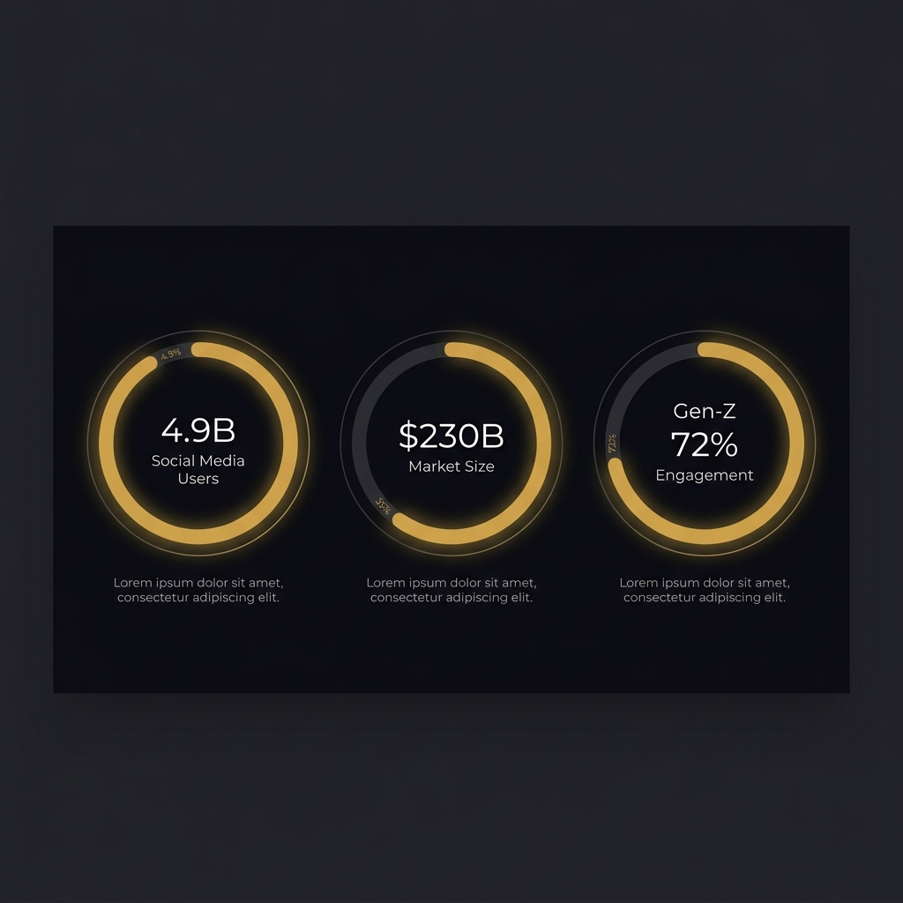
</p>

### Hedef Pazar

| Segment | Büyüklük | BeFake Avantajı |
|---|---|---|
| **Sosyal Medya** | $230B (2025) | Yeni kategori: "Social Roleplay" |
| **Sosyal Gaming** | $25B | Sosyal medya + oyun hibrit |
| **Gen-Z Sosyal** | 2.1B kullanıcı | Anonimlik + yaratıcılık talebi |
| **Roleplay Toplulukları** | 500M+ | Discord/Reddit'te organize, platform yok |

### Rekabet Avantajları

```
                        Anonimlik    Roleplay    Sezonluk    Soy Ağacı    Drama
                        ─────────    ────────    ────────    ─────────    ─────
 Instagram              ✗            ✗           ✗           ✗            ✗
 BeReal                 ✗            ✗           ✗           ✗            ✗
 Discord                △            △           ✗           ✗            ✗
 Roblox/Fortnite        △            △           △           ✗            ✗
 ─────────────────────────────────────────────────────────────────────────────
 BeFake                 ✓            ✓           ✓           ✓            ✓
```

### Büyüme Stratejisi

1. **Faz 1 (0-6 ay):** Türkiye'de üniversite kampüslerinde beta — 10K kullanıcı
2. **Faz 2 (6-12 ay):** Viral sezon eventleri, influencer roleplay kampanyaları — 100K
3. **Faz 3 (12-24 ay):** Cross-platform mobil uygulama, global genişleme — 1M+

---

## 🏗️ TEKNİK MİMARİ

<p align="center">
  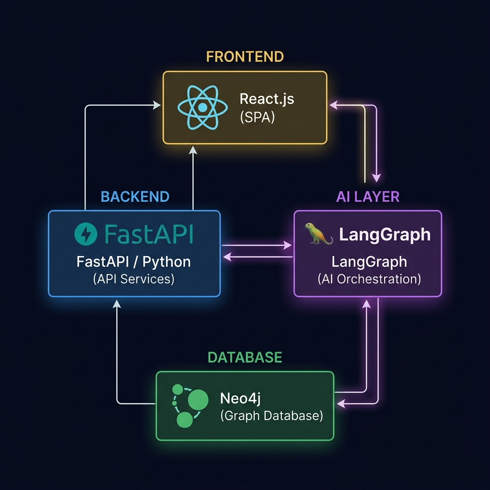
</p>

### Teknoloji Yığını

| Katman | Teknoloji | Neden? |
|---|---|---|
| **Frontend** | React.js + Framer Motion | Hızlı prototipleme, React Native'e geçiş kolaylığı |
| **Backend** | Python (FastAPI) | Asenkron mimari, yüksek throughput |
| **Veritabanı** | Neo4j (Graf DB) | Soy ağacı ilişkileri ms içinde sorgulanır |
| **Gerçek Zamanlı** | WebSockets | Chat, bildirim, canlı etkileşim sinyalleri |
| **AI Katmanı** | LangGraph | Otonom ajanlar: görev atama, NPC yönetimi, hikaye dallanması |
| **Deployment** | GitHub Pages (Demo) → AWS/GCP (Prod) | Ölçeklenebilir altyapı |

### Graf Veritabanı — Soy Ağacı Yapısı

```
                    👑 Kral Aldric
                   ╱             ╲
          🏰 Prens Aeron    🏰 Prenses Lyra
            ╱       ╲              │
     ⚔️ Ser Kael  🧪 Mira    🎵 Ozan Lyris
         │                        │
    🛡️ Gareth               🗡️ Zephyr
```

> **Her düğüm bir gerçek kullanıcı.** Neo4j ile `is_parent_of`, `is_sibling_of`, `is_ally_of` ilişkileri milisaniyeler içinde sorgulanır — yüz binlerce kullanıcı ölçeğinde bile.

---

## 🧠 KEŞFET ALGORİTMASI

BeFake'in hibrit keşfet algoritması 3 temel sinyali birleştirir:

### Skor Formülü

```
İçerik Skoru = (Temel Etkileşim × İvme Çarpanı) × Premium Çarpanı + Dwell Bonus

Temel Etkileşim = beğeni + yorum + paylaşım
İvme Çarpanı    = İlk 15 dk'da yüksek reaksiyon → 2x-5x boost
Premium Çarpanı = Soylu roller için 1.5x-2.0x çarpan
Dwell Bonus     = Ekranda kalma süresi (Intersection Observer API)
```

### Neden Farklı?

| Özellik | Instagram/TikTok | BeFake |
|---|---|---|
| Algoritma Temeli | Geçmiş davranış | Anlık ivme + sosyal bağ |
| Viral Olma Şansı | Sadece büyük hesaplar | Bir köylü bile viral olabilir |
| Premium Avantaj | Reklam harcaması | Soylu rol çarpanı (şeffaf) |
| Gizli Metrik | Gizli, manipülatif | Dwell time → açık "ilgi" sinyali |

---

## 🗺️ YOL HARİTASI

```
 2025 Q3          2025 Q4          2026 Q1          2026 Q2
 ────────         ────────         ────────         ────────
 ✅ MVP Demo      🔨 Beta v1       🚀 Public v1     📱 Mobil App
 ✅ Swipe Test    🔨 Neo4j Enteg.  🚀 Sezon 1       📱 iOS + Android
 ✅ Timeline      🔨 WebSocket     🚀 AI Görevler   📱 Push Bildirim
 ✅ İsyan Mek.    🔨 Auth Sistemi  🚀 Monetizasyon  📱 100K Hedef
 ✅ GitHub Pages  🔨 Kampüs Beta   🚀 10K Kullanıcı 📱 Seed Round
```

---

## 📌 ÖZET — NEDEN BEFAKE?

<table>
  <tr>
    <td align="center" width="25%">
      <h3>🆕</h3>
      <strong>Yeni Kategori</strong><br/>
      Sosyal Roleplay — henüz kimse yapmadı
    </td>
    <td align="center" width="25%">
      <h3>🔄</h3>
      <strong>Döngüsel Bağımlılık</strong><br/>
      Sezon sistemi sürekli geri getirir
    </td>
    <td align="center" width="25%">
      <h3>💰</h3>
      <strong>Kanıtlanmış Model</strong><br/>
      Gaming monetizasyonu + sosyal medya ölçeği
    </td>
    <td align="center" width="25%">
      <h3>🧠</h3>
      <strong>AI Destekli</strong><br/>
      LangGraph ajanları hikayeyi canlı tutar
    </td>
  </tr>
</table>

---

## 👥 EKİP & İLETİŞİM

> *Bu bölümü kendi ekip bilgilerinizle doldurun*

| Rol | İsim | Uzmanlık |
|---|---|---|
| **Kurucu / Ürün** | — | — |
| **Frontend** | — | React.js, Animasyon |
| **Backend** | — | Python, FastAPI, Neo4j |
| **AI / ML** | — | LangGraph, NLP |

---

<p align="center">
  <br/>
  <strong>⚜ BeFake — Sahte Ol. Gerçek Yaşa. ⚜</strong>
  <br/><br/>
  <a href="https://0gunes.github.io/befake-frontend/">🌐 Canlı Demo</a> · 
  <a href="https://github.com/0gunes/befake-frontend">📦 GitHub</a>
  <br/><br/>
  <em>© 2025 BeFake. Tüm hakları saklıdır.</em>
</p>
